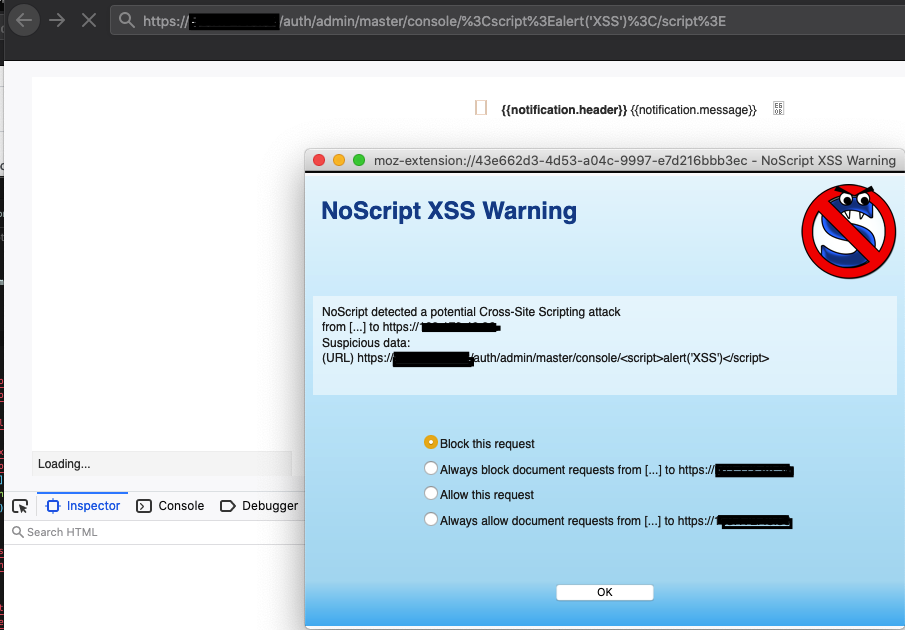

## Keycloak
Looking at the `env` for the springboot app, I found this:

        "spring.security.oauth2.client.provider.keycloak.issuer-uri": {
          "value": "https://keycloak.t4rg3t.net/auth/realms/qcm",
          "origin": "class path resource [application.yml]:26:25"
        },

So now that we have an actual realm, we're going to try a few things:

- admin realm controls
- admin REST api
- persistence

We have more info:
```
[application.yml]:12:18"},"spring.security.oauth2.client.provider.keycloak.issuer-uri":{"value":"https://keycloak.t4rg3t.net/auth/realms/qcm","origin":"class path resource 

[application.yml]:26:25"},"spring.security.oauth2.client.registration.keycloak.client-id":{"value":"qcm-rest-api","origin":"class path resource 

[application.yml]:29:24"},"spring.security.oauth2.client.registration.keycloak.client-secret":{"value":"******","origin":"class path resource 

[application.yml]:30:28"},"spring.security.oauth2.resourceserver.jwt.issuer-uri":{"value":"https://keycloak.t4rg3t.net/auth/realms/qcm"
```

For a token:

    http://localhost:8080/auth/realms/&lt;your-realm-name&gt;/protocol/openid-connect/token


## Bonus round:

#### XXS on keycloak page
